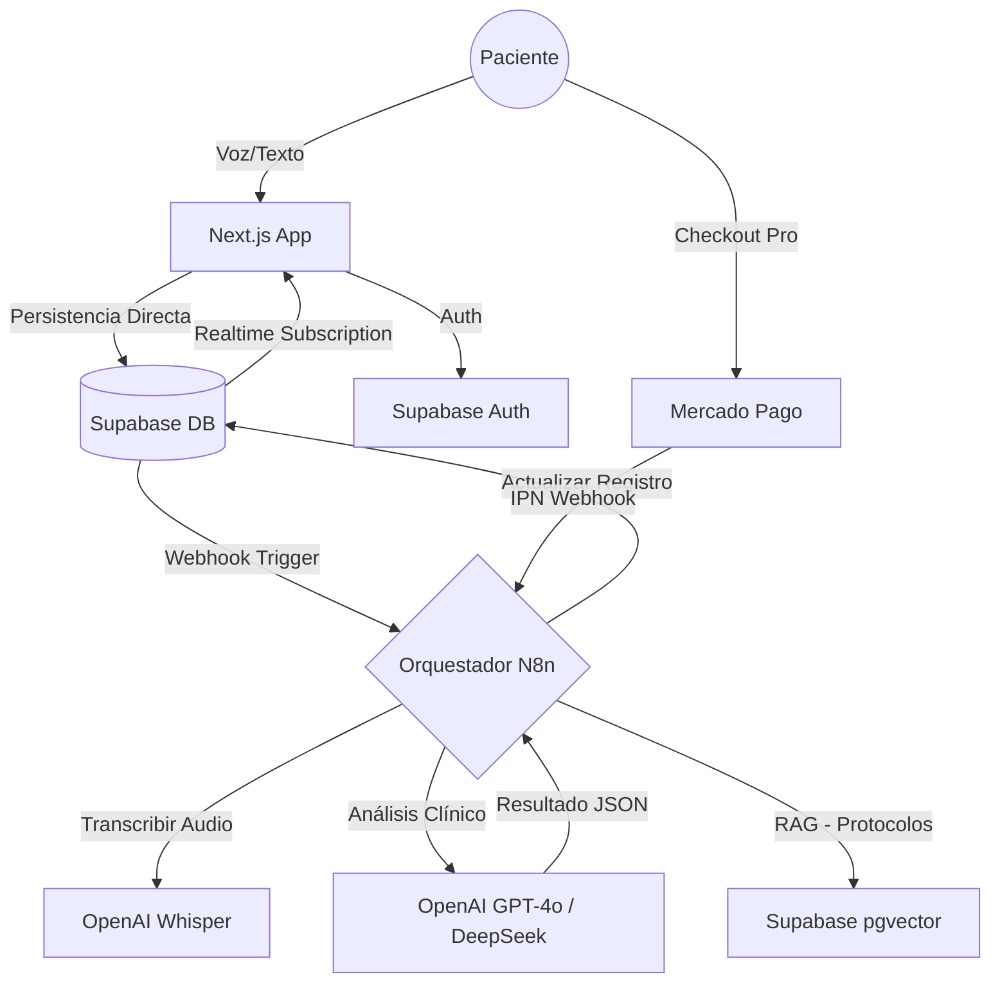

# Plan Maestro de Arquitectura: Plataforma de Terapéutica Natural & Microbiota

**Versión:** 1.0  
**Enfoque:** Telesalud Frugal, Salud Respiratoria e Inteligencia Artificial  
**Región:** México (Cumplimiento LFPDPPP / COFEPRIS)

## 1. Resumen Ejecutivo

Este documento detalla la arquitectura técnica para una Web App de Terapéutica Natural. El sistema utiliza un stack híbrido Low-Code/Pro-Code para minimizar costos operativos mientras maximiza la personalización del paciente mediante IA. La estrategia de entrada al mercado es el “Gancho Respiratorio”, guiando a los usuarios desde el alivio de síntomas agudos hacia la salud preventiva de la microbiota.

## 2. Arquitectura del Sistema (High-Level)

El sistema sigue un patrón Orientado a Eventos. El frontend es ligero, delegando la lógica pesada a N8n y la persistencia a Supabase.



## 3. Especificaciones de Base de Datos (Supabase)

La base de datos PostgreSQL actúa como la fuente única de verdad. Se aplican políticas de seguridad a nivel de fila (RLS) estrictas.

### 3.1 Tablas Principales

#### public.profiles (Identidad y Consentimiento)

```sql
CREATE TABLE public.profiles (
  id uuid REFERENCES auth.users(id) PRIMARY KEY,
  first_name text NOT NULL,
  last_name text NOT NULL,
  dob date, -- Crítico para rangos de referencia (edad biológica)
  phone_number text UNIQUE, -- ID para WhatsApp Business API
  is_patient boolean DEFAULT true,
  consented_to_data_processing boolean DEFAULT false, -- Requisito LFPDPPP (Datos Sensibles)
  created_at timestamptz DEFAULT timezone('utc'::text, now()) NOT NULL
);
```

#### public.symptom_logs (El Gancho Respiratorio)

```sql
CREATE TABLE public.symptom_logs (
  id uuid DEFAULT uuid_generate_v4() PRIMARY KEY,
  patient_id uuid REFERENCES public.profiles(id) NOT NULL,
  symptom_category text CHECK (symptom_category IN ('Respiratory', 'Gastrointestinal', 'Mood', 'General')),
  severity_score int CHECK (severity_score >= 1 AND severity_score <= 10),
  description text, -- Input del usuario
  voice_note_url text, -- URL firmada o path en Storage
  ai_analysis jsonb, -- Ej: {"urgency": "medium", "suggested_action": "hydration"}
  created_at timestamptz DEFAULT now()
);

-- Habilitar RLS
ALTER TABLE public.symptom_logs ENABLE ROW LEVEL SECURITY;

-- Política: Solo el dueño puede ver sus datos
CREATE POLICY "Acceso Privado Paciente" 
ON public.symptom_logs 
FOR SELECT USING (auth.uid() = patient_id);
```

#### public.microbiota_results (Datos de Valor)

```sql
CREATE TABLE public.microbiota_results (
  id uuid DEFAULT uuid_generate_v4() PRIMARY KEY,
  patient_id uuid REFERENCES public.profiles(id) NOT NULL,
  composition_data jsonb, -- Datos crudos de secuenciación
  respiratory_markers jsonb, -- Eje Intestino-Pulmón
  analysis_summary text, -- Explicación simplificada por IA
  pdf_report_url text
);
```

## 4. Automatización y Orquestación (N8n)

### 4.1 Flujo de Triaje Clínico & Voz

- **Disparador:** Webhook desde Next.js o Database Trigger al insertar en `symptom_logs`.
- **Entrada:** Recibe `audio_url` y `patient_id`.
- **Transcripción:** Si existe audio, enviar a nodo OpenAI Whisper.
- **Nota:** Whisper maneja mejor los acentos regionales y terminología médica coloquial mexicana.
- **Contextualización:** Consultar `public.profiles` y últimos 3 registros de `symptom_logs` en Supabase.
- **Análisis IA (Agente "NaturaBot"):**
  - Prompt del Sistema: "Eres un asistente de triaje. Analiza la severidad."
- **Circuit Breaker (Seguridad):** Si detecta palabras clave ("asfixia", "labios azules", "dolor pecho"), saltar a Rama de Emergencia.
- **Rama Normal:** Guardar análisis JSON en `symptom_logs` y actualizar UI vía Realtime.
- **Rama Emergencia:** Enviar SMS/WhatsApp al admin y devolver mensaje estático: "ACUDA A URGENCIAS".

### 4.2 Flujo de Retención (Microbiota Drip)

- **Disparador:** Inserción en `microbiota_results`.
- **Segmentación:** Leer JSONB. Si `diversity_index < 2.5` -> Etiquetar como "Disbiosis Alta".
- **Campaña (WhatsApp/Email):**
  - Día 0: Entrega de resultados + Video explicativo.
  - Día 2: Contenido educativo: "Eje Intestino-Pulmón".
  - Día 5: Venta cruzada: "Probióticos específicos para tu perfil".

## 5. Estrategia de IA y Seguridad

### 5.1 Prompt Engineering (Contexto Cultural)

Los modelos deben configurarse con un tono empático y profesional, respetando la autoridad médica.

**Prompt del Sistema:**

> "Eres NaturaBot, asistente de una clínica de Terapéutica Natural en México. Tu tono es cálido pero profesional.
> REGLAS CRÍTICAS:
> Si identificas una emergencia médica, detente y deriva a urgencias.
> Cumplimiento COFEPRIS: No uses palabras como 'cura milagrosa' o 'garantizado'. Usa 'coadyuvante' o 'soporte'.
> Basa tus respuestas en el contexto del eje intestino-pulmón."

### 5.2 RAG (Retrieval Augmented Generation)

Para evitar alucinaciones, la IA no responde de su conocimiento general, sino de una base de conocimiento curada.

- **Vector Store:** Supabase con pgvector.
- **Documentos:** Protocolos clínicos internos, guías de COFEPRIS, estudios sobre cepas probióticas.

## 6. Frontend (Next.js) & UX

### 6.1 Widget de Voz

- Implementación personalizada para evitar costos de SaaS externos.
- Graba audio en navegador (MediaRecorder API).
- Sube directamente a Supabase Storage (Bucket `voice-notes` privado).
- Envía la URL firmada al backend para procesamiento.

### 6.2 Visualización de Datos

- Uso de librerías como Recharts.
- Gráfico: Barras apiladas (Firmicutes vs Bacteroidetes).
- Insight: Traducción del dato técnico a lenguaje humano (ej. "Tu diversidad es baja, lo que puede afectar tu inmunidad respiratoria").

## 7. Pagos e Infraestructura Comercial

### 7.1 Mercado Pago

- Checkout Pro: Obligatorio para manejar envíos y pagos en OXXO/Efectivo (crucial para mercado masivo).
- Suscripciones: Para el modelo "Health Advisor" recurrente.
- Logística: Configurar `shipments.mode: 'me2'` o recolectar dirección para logística propia.

## 8. Marco Legal y Cumplimiento (México)

### 8.1 Privacidad (LFPDPPP)

- Aviso de Privacidad: Visible antes del registro.
- Consentimiento Expreso: Checkbox obligatorio para tratamiento de datos sensibles (Salud).
- Derechos ARCO: Flujo en N8n para automatizar solicitudes de baja/rectificación de datos.

### 8.2 COFEPRIS (Publicidad)

- Servicios (Consultas): Requiere Aviso de Publicidad (Trámite simple).
- Suplementos: Si se venden productos propios, requieren Permiso de Publicidad.
- Estrategia: Iniciar vendiendo el servicio de análisis y asesoría (Aviso) y recomendar suplementos de terceros autorizados o gestionar el permiso paralelamente.

## 9. Hoja de Ruta de Implementación

| Fase | Duración | Objetivo | Entregable Clave |
| --- | --- | --- | --- |
| 1. Cimientos | Semanas 1-2 | Configuración Backend | Esquema Supabase + RLS + Auth |
| 2. Cerebro | Semanas 3-4 | Lógica N8n | Flujo de Triaje + Integración Whisper |
| 3. Rostro | Semanas 5-6 | Frontend Next.js | UI Chat, Grabación Voz, Dashboard |
| 4. Comercio | Semana 7 | Pagos | Integración Mercado Pago (Sandbox) |
| 5. Legal | Semana 8 | Auditoría | Aviso Privacidad + Documentación COFEPRIS |
